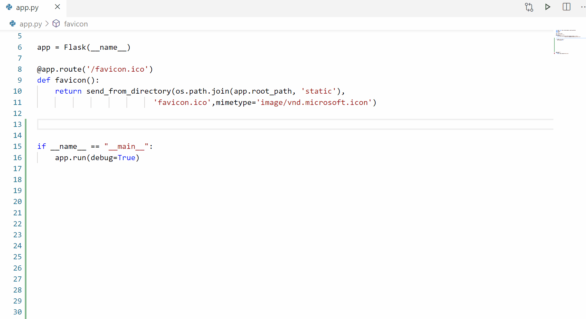
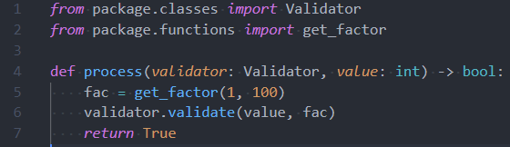

# Pylance

### Fast, feature-rich language support for Python

This repository is for providing feedback and documentation on the Pylance language server extension in Visual Studio Code. You can use the repository to report issues or submit feature requests. The Pylance codebase is not open-source but you can contribute to Pyright to make improvements to the core typing engine that powers the Pylance experience.

# Quick Start

1. Install the [Pylance extension](https://marketplace.visualstudio.com/items?itemName=ms-python.vscode-pylance) from the marketplace.
1. Open a Python (.py) file and the Pylance extension will activate.
1. Select Yes when prompted to make Pylance the default language server. This will update your preferences, which you can also do manually by adding `"python.languageServer": "Pylance"` to your settings.json file using the text editor.

# Features



Pylance provides some awesome features for Python 3, including:

-   Docstrings
-   Signature help, with type information
-   Parameter suggestions
-   Code completion
-   Auto-imports (as well as add and remove import code actions)
-   As-you-type reporting of code errors and warnings (diagnostics)
-   Code outline
-   Code navigation
-   Type checking mode
-   Native multi-root workspace support
-   IntelliCode compatibility
-   Jupyter Notebooks compatibility
-   Semantic highlighting

See the [changelog](CHANGELOG.md) for the latest release.

# Settings and Customization

Pylance provides users with the ability to customize their Python language support via a host of settings which can either be placed in the settings.json file in your workspace, or edited through the Settings Editor UI.

-   `pylance.insidersChannel`

    -   Used to control the insiders download channel.
    -   Available values:
        -   `off` (default)
        -   `daily`

-   `python.analysis.typeCheckingMode`

    -   Used to specify the level of type checking analysis performed.
    -   Default: `off`
    -   Available values:
        -   `off`: No type checking analysis is conducted; unresolved imports/variables diagnostics are produced
        -   `basic`: Non-type checking-related rules (all rules in `off`) + basic type checking rules
        -   `strict`: All type checking rules at the highest severity of error (includes all rules in `off` and `basic` categories)

-   `python.analysis.diagnosticMode`

    -   Used to allow a user to specify what files they want the language server to analyze to get problems flagged in their code.
    -   Available values:
        -   `workspace`
        -   `openFilesOnly` (default)

-   `python.analysis.stubPath`

    -   Used to allow a user to specify a path to a directory that contains custom type stubs. Each package's type stub file(s) are expected to be in its own subdirectory.
    -   Default value: `./typings`

-   `python.analysis.autoSearchPaths`

    -   Used to automatically add search paths based on some predefined names (like `src`).
    -   Available values:
        -   `true` (default)
        -   `false`

-   `python.analysis.extraPaths`

    -   Used to specify extra search paths for import resolution. This replaces the old `python.autoComplete.extraPaths` setting.
    -   Default value: empty array

-   `python.analysis.diagnosticSeverityOverrides`

    -   Used to allow a user to override the severity levels for individual diagnostics should they desire.
    -   Accepted severity values:

        -   `error` (red squiggle)
        -   `warning` (yellow squiggle)
        -   `information` (blue squiggle)
        -   `none` (disables the rule)

    -   Available rule to use as keys can be found [here](DIAGNOSTIC_SEVERITY_RULES.md)
    -   Example:

    ```jsonc
    {
        "python.analysis.diagnosticSeverityOverrides": {
            "reportUnboundVariable": "information",
            "reportImplicitStringConcatenation": "warning"
        }
    }
    ```

-   `python.analysis.useLibraryCodeForTypes`

    -   Used to parse the source code for a package when a typestub is not found.
    -   Accepted values:
        -   `true` (default)
        -   `false`

-   `python.analysis.autoImportCompletions`

    -   Used to control the offering of auto-imports in completions.
    -   Accepted values:
        -   `true` (default)
        -   `false`

-   `python.analysis.completeFunctionParens`

    -   Add parentheses to function completions.
    -   Accepted values:
        -   `true`
        -   `false` (default)

# Semantic highlighting

Visual Studio Code uses TextMate grammars as the main tokenization engine. TextMate grammars work on a single file as input and break it up based on lexical rules expressed in regular expressions.

Semantic tokenization allows language servers to provide additional token information based on the language server's knowledge on how to resolve symbols in the context of a project. Themes can opt-in to use semantic tokens to improve and refine the syntax highlighting from grammars. The editor applies the highlighting from semantic tokens on top of the highlighting from grammars.

Here's an example of what semantic highlighting can add:

Without semantic highlighting:



With semantic highlighting:


Semantic colors can be customized in settings.json by associating the Pylance semantic token types and modifiers with the desired colors.

-   Semantic token types

    -   class, enum
    -   parameter, variable, property, enumMember
    -   function, member
    -   module
    -   intrinsic
    -   magicFunction (dunder methods)
    -   selfParameter, clsParameter

-   Semantic token modifiers
    -   declaration
    -   readonly, static, abstract
    -   async
    -   typeHint, typeHintComment
    -   decorator
    -   builtin

The [scope inspector](https://code.visualstudio.com/api/language-extensions/syntax-highlight-guide#scope-inspector) tool allows you to explore what semantic tokens are present in a source file and what theme rules they match to.

Example of customizing semantic colors in settings.json:

```jsonc
{
    "editor.semanticTokenColorCustomizations": {
        "[One Dark Pro]": {
            // Apply to this theme only
            "enabled": true,
            "rules": {
                "magicFunction:python": "#ee0000",
                "function.declaration:python": "#990000",
                "*.decorator:python": "#0000dd",
                "*.typeHint:python": "#5500aa",
                "*.typeHintComment:python": "#aaaaaa"
            }
        }
    }
}
```

# Troubleshooting

Known issues are documented in [TROUBLESHOOTING](TROUBLESHOOTING.md).

# Contributing

Pylance leverages Microsoft's open-source static type checking tool, Pyright, to provide performant language support for Python.

Code contributions are welcomed via the [Pyright](https://github.com/microsoft/pyright) repo.

Pylance also makes use of some type stub files, either from typeshed, or some additional ones that we eventually hope to move either inline in the source packages or to typeshed. You can find and contribute to our work-in-progress type stubs at https://github.com/microsoft/python-type-stubs.

For information on getting started, refer to the [CONTRIBUTING instructions](https://github.com/microsoft/pyright/blob/master/CONTRIBUTING.md).

# Feedback

-   File a bug in [GitHub Issues](https://github.com/microsoft/pylance-release/issues/new/choose)
-   [Tweet us](https://twitter.com/pythonvscode/) with other feedback

# License

See [LICENSE](LICENSE) for more information.
