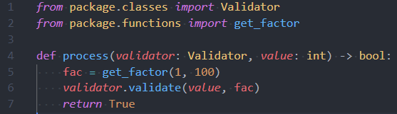

# Pylance

### Fast, feature-rich language support for Python

This repository is for providing feedback and documentation on the [Pylance language server extension](https://marketplace.visualstudio.com/items?itemName=ms-python.vscode-pylance) in Visual Studio Code. You can use the repository to report issues or submit feature requests. The Pylance codebase is not open-source but you can contribute to [Pyright](https://github.com/microsoft/pyright) to make improvements to the core typing engine that powers the Pylance experience.

Pylance is the default language support for [Python in Visual Studio Code](https://marketplace.visualstudio.com/items?itemName=ms-python.python) and is shipped as part of that extension as an optional dependency.

# Quick Start

1. Install the [Python extension](https://marketplace.visualstudio.com/items?itemName=ms-python.python) from the marketplace. Pylance will be installed as an optional extension.
1. Open a Python (.py) file and the Pylance extension will activate.

Note: If you've previously set a language server and want to try Pylance, make sure you've set `"python.languageServer": "Default" or "Pylance"` in your settings.json file using the text editor, or using the Settings Editor UI.

# Features


Pylance provides some awesome features for Python 3, including:

-   Docstrings
-   Signature help, with type information
-   Parameter suggestions
-   Code completion
-   Auto-imports (as well as add and remove import code actions)
-   As-you-type reporting of code errors and warnings (diagnostics)
-   Code outline
-   Code navigation
-   Type checking mode
-   Native multi-root workspace support
-   IntelliCode compatibility
-   Jupyter Notebooks compatibility
-   Semantic highlighting

See the [changelog](CHANGELOG.md) for the latest release.

# Settings and Customization

Pylance provides users with the ability to customize their Python language support via a host of settings which can either be placed in the settings.json file in your workspace, or edited through the Settings Editor UI.

-   `python.analysis.typeCheckingMode`

    -   Used to specify the level of type checking analysis performed.
    -   Default: `off`
    -   Available values:
        -   `off`: No type checking analysis is conducted; unresolved imports/variables diagnostics are produced
        -   `basic`: Non-type checking-related rules (all rules in `off`) + basic type checking rules
        -   `strict`: All type checking rules at the highest severity of error (includes all rules in `off` and `basic` categories)

-   `python.analysis.diagnosticMode`

    -   Used to allow a user to specify what files they want the language server to analyze to get problems flagged in their code.
    -   Available values:
        -   `workspace`
        -   `openFilesOnly` (default)

-   `python.analysis.include`
    -   Paths of directories or files that should be included. If no paths are specified, Pylance defaults to the directory that contains workspace root. Paths may contain wildcard characters `**` (a directory or multiple levels of directories), `*` (a sequence of zero or more characters), or `?` (a single character).
    -   Default value: empty array

-   `python.analysis.exclude`
    -   Paths of directories or files that should not be included. These override the include directories, allowing specific subdirectories to be excluded. Note that files in the exclude paths may still be included in the analysis if they are referenced (imported) by source files that are not excluded. Paths may contain wildcard characters `**` (a directory or multiple levels of directories), `*` (a sequence of zero or more characters), or `?` (a single character). If no exclude paths are specified, Pylance automatically excludes the following: `**/node_modules`, `**/__pycache__`, `.git` and any virtual environment directories.
    -   Default value: empty array

-   `python.analysis.ignore`
    -   Paths of directories or files whose diagnostic output (errors and warnings) should be suppressed even if they are an included file or within the transitive closure of an included file. Paths may contain wildcard characters `**` (a directory or multiple levels of directories), `*` (a sequence of zero or more characters), or `?` (a single character). If no value is provided, the value of `python.linting.ignorePatterns` (if set) will be used.
    -   Default value: empty array

-   `python.analysis.stubPath`

    -   Used to allow a user to specify a path to a directory that contains custom type stubs. Each package's type stub file(s) are expected to be in its own subdirectory.
    -   Default value: `./typings`

-   `python.analysis.autoSearchPaths`

    -   Used to automatically add search paths based on some predefined names (like `src`).
    -   Available values:
        -   `true` (default)
        -   `false`

-   `python.analysis.extraPaths`

    -   Used to specify extra search paths for import resolution. This replaces the old `python.autoComplete.extraPaths` setting.
    -   Default value: empty array

-   `python.analysis.indexing`

    - Used to specify whether Pylance should index installed third party libraries and user files to provide features such as auto-import, add import, workspace symbols, etc.
    - Available values:
        - `null` (default)
        - `true`
        - `false`

-   `python.analysis.autoImportCompletions`

    -   Used to control the offering of auto-imports in completions.
    -   Accepted values:
        -   `true` (default)
        -   `false`

-   `python.analysis.packageIndexDepths`

    -   Used to control how many installed packages indexer will index.
    -   Default value: empty array
    -   Accepted values: 
        -   Tuple of [```package name```, ```depth to scan```, ```include all symbols```]
    -   Example:

    ```jsonc
    {
        "python.analysis.packageIndexDepths": [["pandas", 3, true], ["numpy", 2, false]]
    }    
    ```

-   `python.analysis.diagnosticSeverityOverrides`

    -   Used to allow a user to override the severity levels for individual diagnostics should they desire.
    -   Accepted severity values:

        -   `error` (red squiggle)
        -   `warning` (yellow squiggle)
        -   `information` (blue squiggle)
        -   `none` (disables the rule)

    -   Available rule to use as keys can be found [here](DIAGNOSTIC_SEVERITY_RULES.md)
    -   Example:

    ```jsonc
    {
        "python.analysis.diagnosticSeverityOverrides": {
            "reportUnboundVariable": "information",
            "reportImplicitStringConcatenation": "warning"
        }
    }
    ```

-   `python.analysis.useLibraryCodeForTypes`

    -   Used to parse the source code for a package when a typestub is not found.
    -   Accepted values:
        -   `true` (default)
        -   `false`

-   `python.analysis.completeFunctionParens`

    -   Add parentheses to function completions.
    -   Accepted values:
        -   `true`
        -   `false` (default)

-   `python.analysis.importFormat`

    -   Defines the default format for import module.
    -   Accepted values:
        -   `absolute` (default)
        -   `relative`

-   `python.analysis.inlayHints.variableTypes`

    -   Enable/disable inlay hints for variable types.
    -   Accepted values:
        -   `true`
        -   `false` (default)

-   `python.analysis.inlayHints.functionReturnTypes`

    -   Enable/disable inlay hints for function return types.
    -   Accepted values:
        -   `true`
        -   `false` (default)

# Semantic highlighting

Visual Studio Code uses TextMate grammars as the main tokenization engine. TextMate grammars work on a single file as input and break it up based on lexical rules expressed in regular expressions.

Semantic tokenization allows language servers to provide additional token information based on the language server's knowledge on how to resolve symbols in the context of a project. Themes can opt-in to use semantic tokens to improve and refine the syntax highlighting from grammars. The editor applies the highlighting from semantic tokens on top of the highlighting from grammars.

Here's an example of what semantic highlighting can add:

Without semantic highlighting:


With semantic highlighting:



Semantic colors can be customized in settings.json by associating the Pylance semantic token types and modifiers with the desired colors.

-   Semantic token types

    -   class, enum
    -   parameter, variable, property, enumMember
    -   function, member
    -   module
    -   intrinsic
    -   magicFunction (dunder methods)
    -   selfParameter, clsParameter

-   Semantic token modifiers
    -   declaration
    -   readonly, static, abstract
    -   async
    -   typeHint, typeHintComment
    -   decorator
    -   builtin

The [scope inspector](https://code.visualstudio.com/api/language-extensions/syntax-highlight-guide#scope-inspector) tool allows you to explore what semantic tokens are present in a source file and what theme rules they match to.

Example of customizing semantic colors in settings.json:

```jsonc
{
    "editor.semanticTokenColorCustomizations": {
        "[One Dark Pro]": {
            // Apply to this theme only
            "enabled": true,
            "rules": {
                "magicFunction:python": "#ee0000",
                "function.declaration:python": "#990000",
                "*.decorator:python": "#0000dd",
                "*.typeHint:python": "#5500aa",
                "*.typeHintComment:python": "#aaaaaa"
            }
        }
    }
}
```
# Source Code Actions

-   `source.fixAll.unusedImports`

    -   Remove all unused imports in a file

-   `source.fixAll.convertImportFormat`

    -   Convert import format according to `python.analysis.importFormat`.

# Auto/Add import and indexing

Pylance has a feature called ```auto import``` which shows symbols from installed packages and user files during completion. When committed, pylance will automatically generate an ```import``` statement. It also has something called ```add import``` which shows symbols from installed packages and user files for an unknown identifier. When selected, this will also insert an ```import``` statement.

Since these features can be costly, we have enabled the minimum set and provide multiple settings to control the behavior.

When ```python.analysis.indexing``` is off, we will only show symbols already used by opened files transitively. If ```indexing``` is on, we will spend some time indexing installed packages and user files when pylance is started, but after that, we will provide symbols that you haven't used yet in completion and code action.

But since indexing is an expensive operation, we do not index every symbol from all installed packages but only top-level symbols. In another words, symbols in ```__all__``` in ```package/__init__```. If users want more than that, they need to use ```python.analysis.packageIndexDepths``` to tell us which packages they want us to spend more time on. Symbols indexed will show up both in completion and code actions.

For user files, we index up to 2000 files. One difference between user files and installed packages is that they won't appear in completion unless they are already used. Unlike installed packages, we, by default, index all symbols from user files, which can cause thousands of user symbols to show up in completion. 

We choose to show them only in code action since it requires explicit user action ```Ctrl+.``` rather than automatically triggered like completion.

For people who don't want ```auto import``` suggestion ever show up in completion since they feel it bloats the completion, we have ```python.analysis.autoImportCompletions``` to disable it. And solely rely on code action.

# Troubleshooting

Known issues are documented in [TROUBLESHOOTING](TROUBLESHOOTING.md).

# Contributing

Pylance leverages Microsoft's open-source static type checking tool, Pyright, to provide performant language support for Python.

Code contributions are welcomed via the [Pyright](https://github.com/microsoft/pyright) repo.

Pylance ships with a collection of type stubs for popular modules to provide fast and accurate auto-completions and type checking. Our type stubs are sourced from [typeshed](https://github.com/python/typeshed) and our work-in-progress stub repository, [microsoft/python-type-stubs]( https://github.com/microsoft/python-type-stubs). Type stubs in microsoft/python-type-stubs will be contributed back to typeshed or added inline to source packages once they are of high enough quality.

For information on getting started, refer to the [CONTRIBUTING instructions](https://github.com/microsoft/pyright/blob/master/CONTRIBUTING.md).

# Feedback

-   File a bug in [GitHub Issues](https://github.com/microsoft/pylance-release/issues/new/choose)
-   [Tweet us](https://twitter.com/pythonvscode/) with other feedback

# License

See [LICENSE](LICENSE) for more information.
